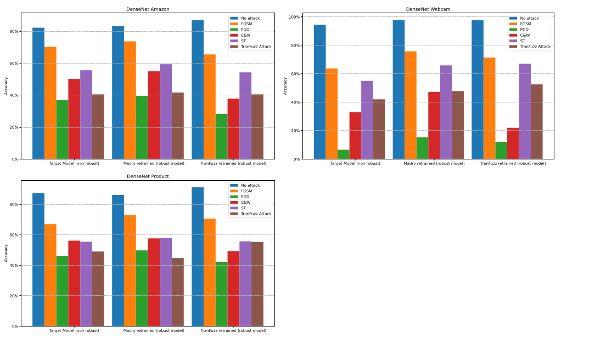

## 📚 Reference 
Hao Li, Shanqing Guo, Peng Tang, Chengyu Hu, Zhenxiang Chen: *TranFuzz: An Ensemble Black-Box Attack Framework Based on Domain Adaptation and Fuzzing*. ICICS (1) 2021: 260-275.

## 🎯 Goal
The goal of this project was to study and evaluate **TranFuzz**, an advanced framework designed for black-box adversarial attacks on artificial neural networks.

## 🛡️ TranFuzz System
TranFuzz is an advanced framework designed to generate highly transferable adversarialexamples. It is built upon two core components:

* Domain adaptation using a Deep Subdomain Adaptation Network (DSAN), which aligns the source and target data distributions. This enables the creation of a local substitute model that accurately mimics the target model’s behavior, even without access to the target data.
* Adversarial example generation using fuzzing techniques, which exploit neuron coverage metrics to identify model vulnerabilities and apply mutations that maximize attack transferability.

Additionally, TranFuzz introduces a novel ensemble-based seed mutation strategy to increase the diversity and effectiveness of generated adversarial samples.

## ⚙️ Process
In order to determine whether the system works better than other conventional attacks and defense methods, we had to compare them step by step with TranFuzz. 

To be able to follow our protocol, we developed an improvement of the code given from the article.

We first trained a target model, measured its accuracy on the test dataset : the percentage of correct label classification against all images on the test dataset.

## 📊 Attack Results

*Figure: DenseNet-121 result charts on different datasets*

Across all attacked datasets, TranFuzz successfully achieved a more significant drop in DenseNet model accuracy compared to its black-box competitor, Spatial Transformation (ST). In several cases, its performance even approached that of powerful white-box attack models such as PGD and Carlini & Wagner.

While TranFuzz shows promising results, further testing on more modern architectures and larger datasets is essential to confirm its generalizability.

**Authors** : [Noé Backert](https://github.com/noebackert), [Timothée Cloup-Martin](https://github.com/timotheeCloup), Thimoté Dupuch
